<!-- @format -->

# aws solution architect

## List of solutions

- sts = role

- s3 key = SSE-KMS
- **_Exam:_**

  - keys never leave KMS = KMS FIPS = 140-2 (L2) Level 2

- CMKs can be used for up to **4KB of data**

- KMS doesn't actually perform the encryption or decryption on the data larger than 4KB

- encryption key rotation = KMS
- **_Exam:_**

  - S3 encryption = SSE-C, SSE-S3 **(AES256)**, SSE-KMS
  - MFA is required to **delete versions**
  - MFA is required to change bucket **version state**

- **tow party or more involb = Asymmetric Encription**

  - 

- **one or single = symmetric Encription**

  - <a href="./AWS-Certified-Solutions-Architect/Screenshot_10.png">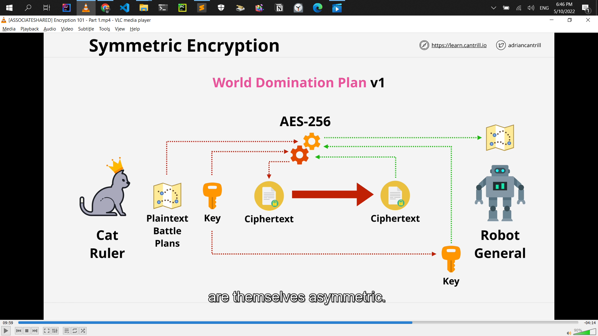</a>

- **Asymmetric= signing**

  - <a href="./AWS-Certified-Solutions-Architect/Screenshot_12.png">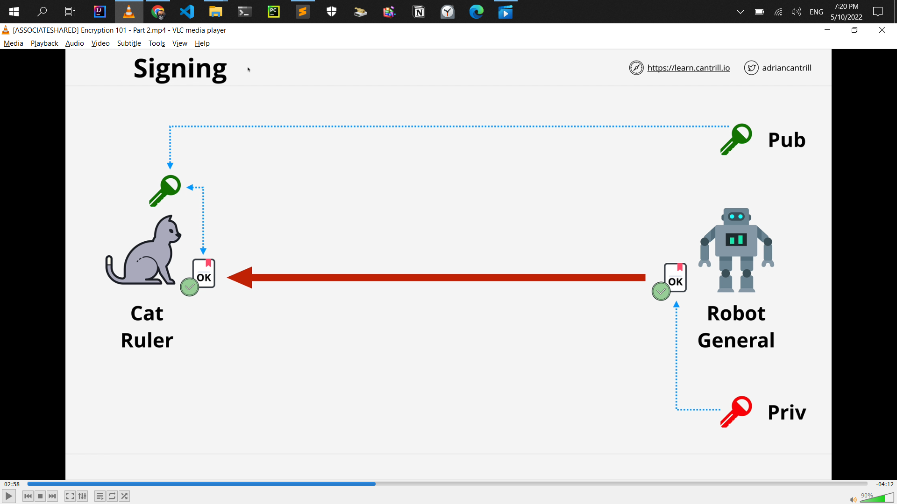</a>

- **hiding something in something else = Steganography**

  - <a href="./AWS-Certified-Solutions-Architect/Screenshot_13.png">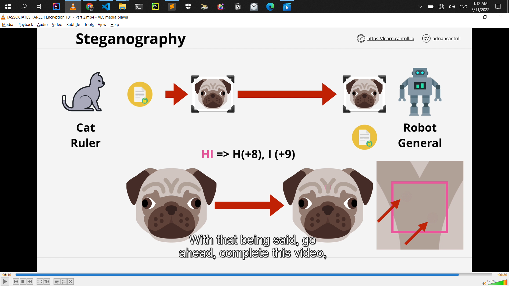</a>

- **S3 Lifecycle Configuration - Transitions**

  - **Minimum of 30 days** before transition
  - smaller objects can **cost more** (minimum size)
  - <a href="./AWS-Certified-Solutions-Architect/Screenshot_22.png">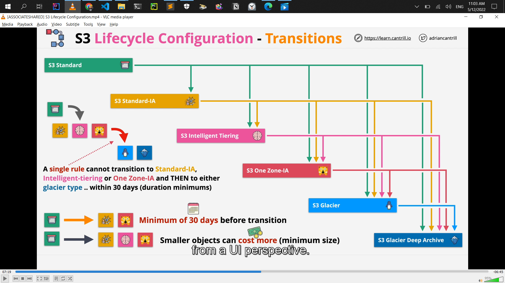</a>

- S3 Tansfer Acceleration
  - default = off
  - the bucket name can not conatin periods
  - the bucket name needs to be DNS compatible
- Replication Time Control (RTC) = 15 minutes replication time

- # S3 Replication Considerations
  - **_Exam:_**
    - **Not retroactive**=_Replication_ & Versioning need to be **ON**
    - **One-way replication** Source to Destination
    - Unencrypted, SSE-S3 & SSE-KMS (**_with extra configuration_**)
    - Source bucket owner needs permission to object
    - No **system events**=_life cycle_, **Glaicer** or **Glacier Deep Archive**
    - **No DELETES**
- S3 is private by default
- VPC `Base IP +2` Address
- **enableDnsHostnames** - gives instances DNS Names
- **enableDnsSupport** - enables DNS resolution in VPC

- NAT gateway charges
  - running a NAT gateway hourly = $0.045 per hour
  - partial hour is full hour
  - The Data Processing charge will result in a charge of $0.045.
- NAT instance VS NAT gateway
  - NAT gateway = more cost, more capacity, more flexibility
  - NAT instance = less cost, less capacity, less flexibility
  - Disable **Source/Destination Checks** in NAT instance
- **NAT gateway = NACL = Network ACL** cannot be use security groups
- NAT Gateways **don't work with IPv6**
- Attached to ENI's not instances(even if the UI shows it this way)
- route table associated with many route table
- subnet only associated with one route table
- local route always take priority
- subnet to have a route table associated with the main VPC or custom you created the route table
- IGW **region resilient** gateway
- NAT **region resilient** gateway
- **instance it self is not configured with that public IP**
- **EC2 instance it just has a private IP**
- **one subnet is in one availability zone**

  - **subnet can never be in more than one availability zone**

## Subnet IP Addressing

- **Reserved IP addresses (5 in total)**

- **10.16.16.0/20 (10.16.16.0 => 10.16.31.255)**
- **Network Address (10.16.16.0)**

- **`Network +1` (10.16.16.1) - VPC Router**

- **`Network +2` (10.16.16.2) - Reserved (DNS\*)**
- **`Network +3` (10.16.16.3) - Reserved Future Use**

- **Broadcast Address 10.16.31.255 (Last IP in subnet)**

- ### Exam alert

  - **which IP Address range the EC2 instance connects service users**
    - [IP Address Range](https://ip-ranges.amazonaws.com/ip-ranges.json)

- ### Exam alert

  - This is need System Ops and Developer associate
  - **Storage performance in IOPS need to experienced**

- ### Exam alert
- ## Instance Store VS EBS

  - **Cheap = ST1 or SC1**

  - **Throughput .. streaming ... ST1**
  - **Boot ............. NOT ST1 or SC1**
  - **GP2/3 - up to 16,000 IOPS**

  - **101/2 - up to 64,000 1OPS (\*256,000)**
  - **RAIDO + EBS up to 260,000 IOPS (101/2-BE/GP2/3)**
  - **More than 260,000 IOPS - INSTANCE STORE**

  - <a href="./AWS-Certified-Solutions-Architect/Screenshot_59.png">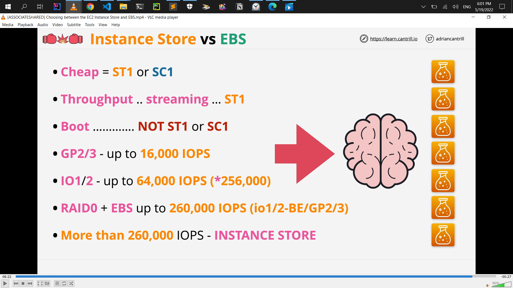</a>

- ### Exam alert
- ## EBS Snapshots/Volume Performance

  - **New EBS volume = full performance immediately**
  - **Snaps restore lazily - fetched gradually**
  - **Requested blocks are fetched immediately**

  - **Force a read of all data immediately ...**
  - **Fast Snapshot Restore (FSR) - Immediate restore**
  - **.. up to 50 snaps per region. Set on the Snap & AZ**

- ### AMI Exam Tips

  - **AMI = One Region, only works in that one region**
  - **AMI Baking .. creating an AMI from a configured instance +
    application**

  - **An AMI can't be edited .. launch instance, update
    configuration and make a new AMI**
  - **Can be copied between regions (includes its snapshots)**
  - **Remember permissions .. default = your account**

### EC2 Instance

- get instance metadata
- [http://169.254.169.254/latest/meta-data/](http://169.254.169.254/latest/meta-data/)

- ### It's critical to know in SystemOps

  - that at no point ever,
  - private IP address is exposed to the internet via NAT gateway

- ### Exam alert

  - **task definition** stores is the task role.
  - A task role is an IAM role that a task can assume. And when the task assumes that role, it gains temporary credentials, which can be used within the task to interact with AWS resources.

  <a href="./AWS-Certified-Solutions-Architect/Screenshot_75.png">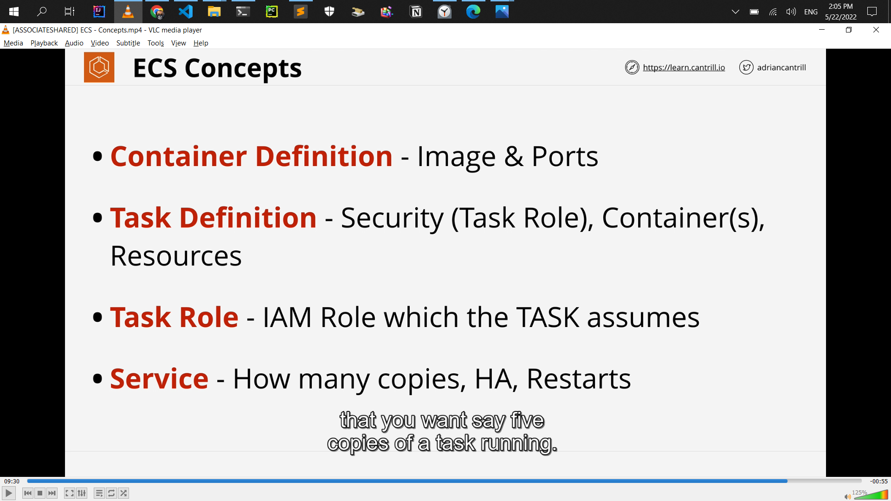</a>

- SSM Parameter Store

  - Storage for configuration & secrets
    String, StringList & SecureString
  - License codes, Database Strings, Full Configs & Passwords

  - Hierarchies & Versioning
  - Plaintext and Ciphertext
  - Public Parameters - Latest AMIs per region

- EC2 Placement Groups

  - understand between this 3 placement groups for exam
  - **Cluster** - Pack instances close together
  - **Spread** - Keep instances separated
  - **Partition** - groups of instances spread apart

- Dedicated Host Limitations & Features

  <a href="./AWS-Certified-Solutions-Architect/Screenshot_101.png">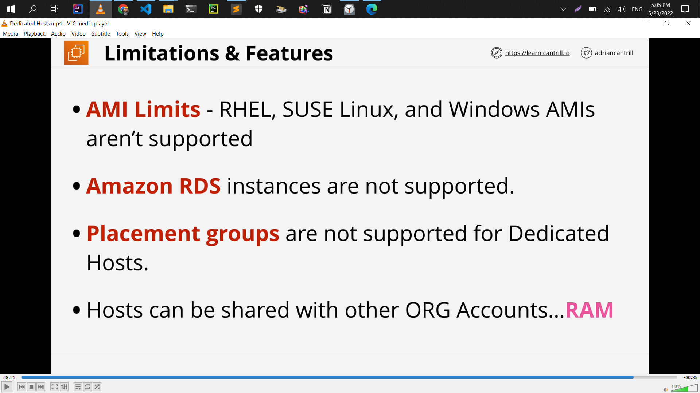</a>

- Enhanced Networking

  <a href="./AWS-Certified-Solutions-Architect/Screenshot_102.png">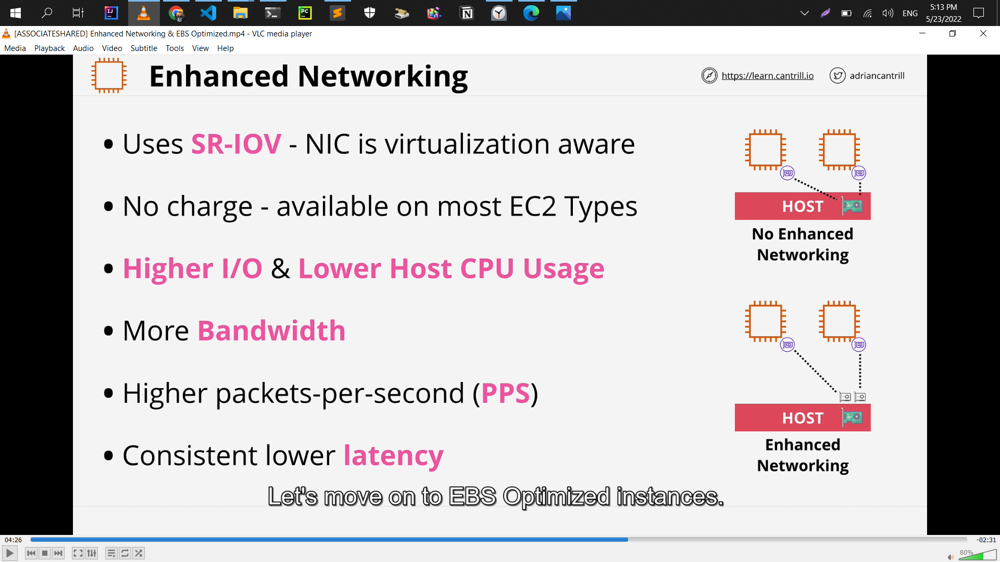</a>

- R53 CNAME VS ALIAS

  <a href="./AWS-Certified-Solutions-Architect/Screenshot_110.png">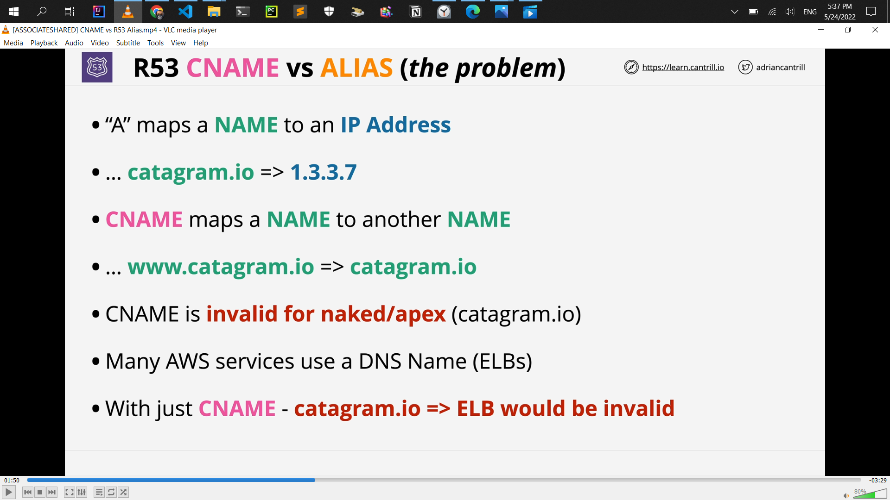</a>

  <a href="./AWS-Certified-Solutions-Architect/Screenshot_111.png">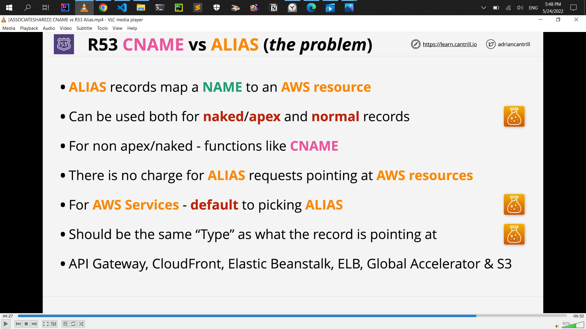</a>

- Route53 Simple Routing

  <a href="./AWS-Certified-Solutions-Architect/Screenshot_112.png">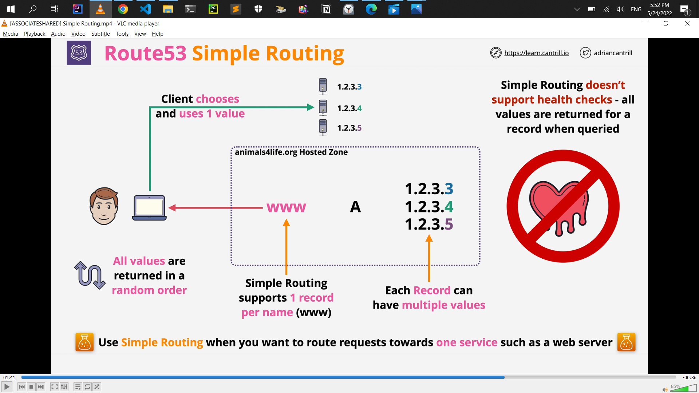</a>

- Route 53 Health Checks

<a href="./AWS-Certified-Solutions-Architect/Screenshot_113.png">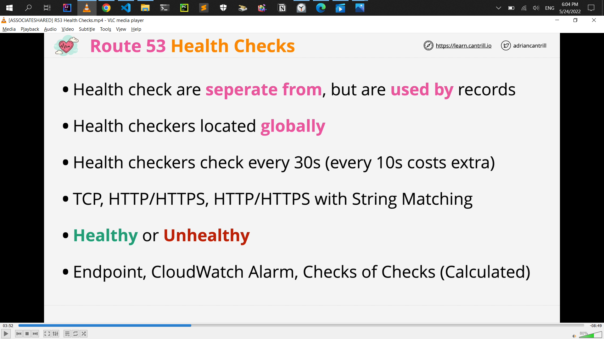</a>

- Route53 Failover Routing

<a href="./AWS-Certified-Solutions-Architect/Screenshot_114.png">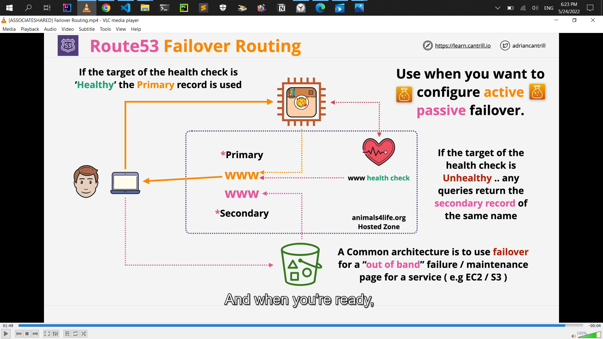</a>

- ACID vs BASE

<a href="./AWS-Certified-Solutions-Architect/Screenshot_131.png">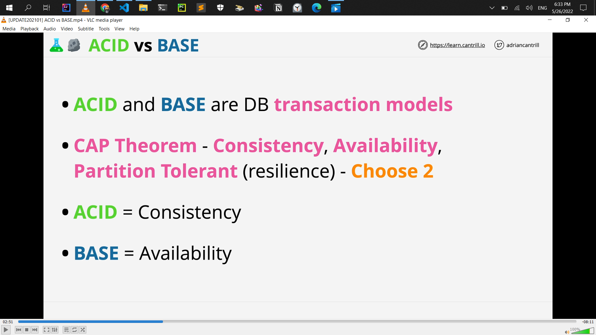</a>

- Exam Alert

  - BASE = NOSQL Database
  - ACID = RDS Database
  - NOSQL or DynamoDB with ACID = DynamoDB transection
  - only access RDS using CNAME and CNAME points normally at the primary instance
  - RDS MultiAZ can be used to scale the amount of reads != ?
  - don't fall for questions wich talk about MultiAZ across different regions != ?
    - it can only occur with other availiability zones inside the same VPC inside the same region
  - synchronous replication = MultiAZ
  - standby replica cannot be used to read, or write operations to the RDS instance
  - RDS Backups and Restores need to know for exam
  - you can plain disaster recovery within your business or understand and answer exam questions which involve disaster recovey and business continuty
  - RTO vs RPO need to know for exam
  - final snapshots backups Before RDS instance remove
  - synchronous replication = Multi-AZ
  - asynchronous replication = Read-Replica
  - Read-replicas are read-only until they're promoted read-replica to be read and write that process is not reversible and you have to delete and create new read replica
  - Fail-over times are typically 60 to 120 seconds
  - Aurora Global Database = global database allow you to create global level replication using Aurora from master region to up to five secondary AWS region

    <a href="./AWS-Certified-Solutions-Architect/Screenshot_143.png">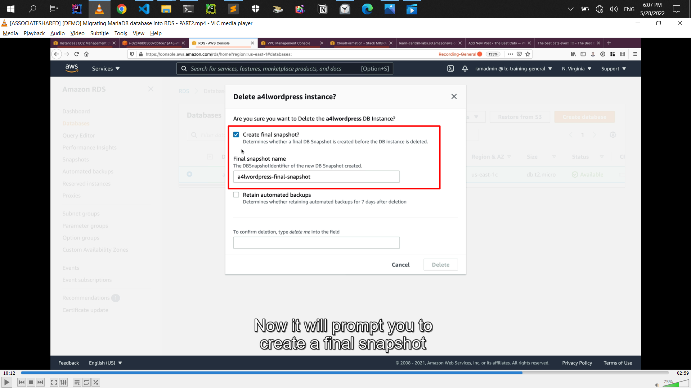</a>

    <a href="./AWS-Certified-Solutions-Architect/Screenshot_164.png">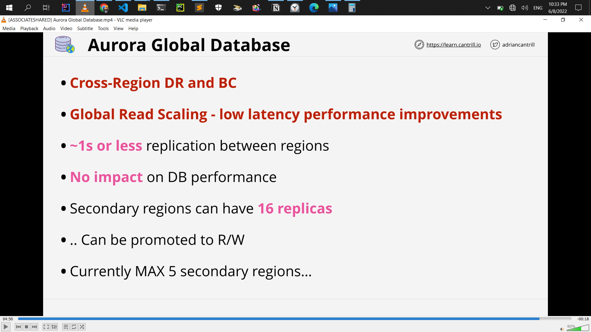</a>

  - DMS = Data Migration Service
  - database migration scenario = default DMS, if say no downtime migration then you absolutely should default to DMS
  - SCT = only used for migrations when the engine is changing
  - EFS = Automatic backups need tp in details for exam

- SystemOps or Developer
  - Database authentication options
    - Database authentication inside = Password and IAM database authentication need to know
    - Architect need just = Password authentication
    - DataBase Monitoring CloudWatch = significantly need to knwo more
    - aurora
      - connectivity
      - Aadditional Configuration
      - Web Service Data API
        <a href="./AWS-Certified-Solutions-Architect/Screenshot_162.png">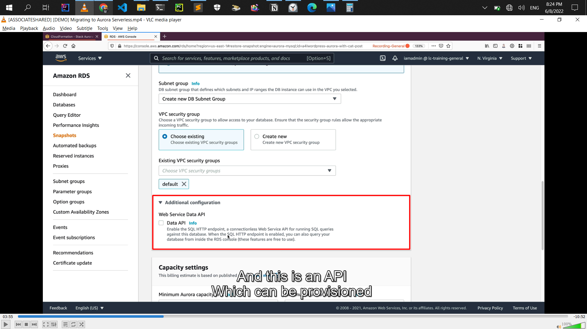</a>
- SystemOps or Developer or SA Pro or DevOps Pro

  - Database Additional configuration
    - need to know `DB parameter group` & `Option Group`

- **Authorisation** is controlled by the **_DB
  Engine_**, Permissions are assigned to
  the local DB User. **IAM is NOT used to
  authorise**, only for authentication
- Aurora Clsuter Volume: Max 128 TiB, 6 Replicas, AZs and per 2 replicas per AZs
- Aurora you've got 1 read/write primary instance and 15 different read replicas total 16 replica

# HA & SCALING

- Exam Alert
  - decide whether that Load Balancer shoud be internet-facing or wether it shoud be internal
    - if you pick internet-facing then the nodes of that Load Balancer are given public address and private addresss
    - if you pick internal then the nodes only have private IP addresses
  - internet-facing Load Balancer does not need private or public instances. **it can work with both of those**
    - **internet-facing LB nodes can be access **_public_** & **_private_** EC2 instance**
  - minimum per subnet `/27` for load balacner but if exam show `/28` dont show `/27` then `/28` is correct
  - **CROSS-ZONE LB** = not default enable
  - **ALB** = IS default enable as standard
  - **_EC2_** **doesn't need to be public** to work with a LB
  - **8+** Free IPs per subnet , and **/27** subnet to allow scaling
  - which are really stict on performance then you might want to look at Network Load Balancer **_(NLB)_**
  - if you have to forward encrypted connections throught to the instances without terminating them on the load balancer. then you need to use a Network Load Balancer
  - which talk about things which aren't web or secure web and don't use HTTP OR HTTPS = then you should probably default to Network Load balancers.
  - **Forward TCP** to instances ...**unbroken encryption**
  - Used with private link to provide services to other VPCs.
  - for any knwo periods of high or low usage = know periods of usage == then **Scheduled Scaling**

# SERVERLESS AND APPLICATION SERVICES

- Exam Alert
  - Lamda function = **900s** (**15**M maximum)
  - Docker **is not supported (anti pattern)** for the exam
  - Custom runtime such as **Rust** are possible using layers
  - lamda has two networking mode = public, VPC networking
  - lamda functions running in a **_VPC_** **obey all VPC networking rules**
  - executing Lamda functions within a VPC
    <a href="./AWS-Certified-Solutions-Architect/Screenshot_229.png">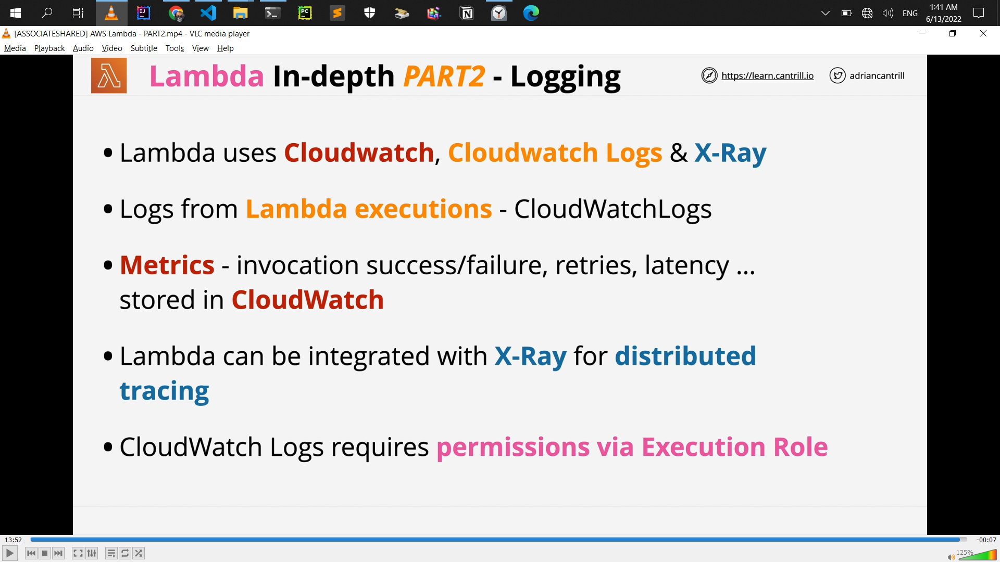</a>
  - synchronous invocation
  - asynchronous invocation
  - Event Source mappings
