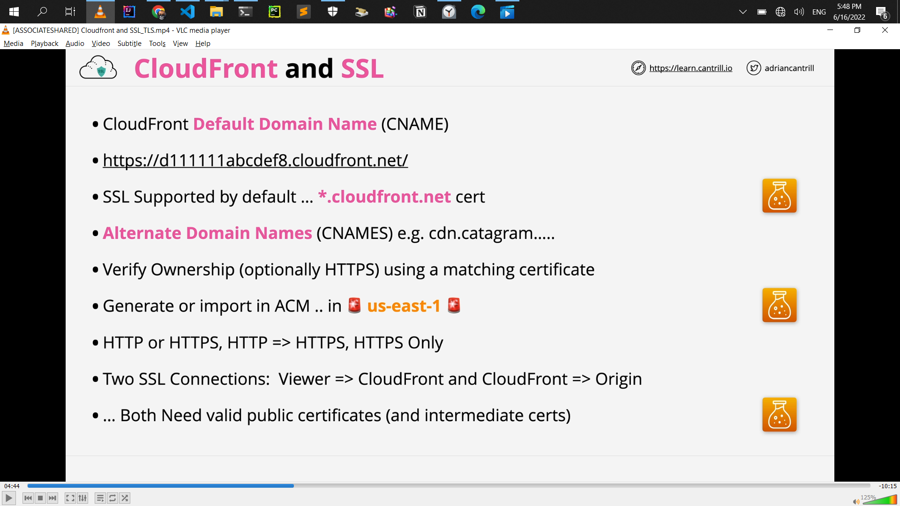

<!-- @format -->

# aws solution architect

## List of solutions

- sts = role

- s3 key = SSE-KMS
- **_Exam:_**

  - keys never leave KMS = KMS FIPS = 140-2 (L2) Level 2

- CMKs can be used for up to **4KB of data**

- KMS doesn't actually perform the encryption or decryption on the data larger than 4KB

- encryption key rotation = KMS
- **_Exam:_**

  - S3 encryption = SSE-C, SSE-S3 **(AES256)**, SSE-KMS
  - MFA is required to **delete versions**
  - MFA is required to change bucket **version state**

- **tow party or more involb = Asymmetric Encription**

  - 

- **one or single = symmetric Encription**

  - 

- **Asymmetric= signing**

  - 

- **hiding something in something else = Steganography**

  - 

- **S3 Lifecycle Configuration - Transitions**

  - **Minimum of 30 days** before transition
  - smaller objects can **cost more** (minimum size)
  - 

- S3 Tansfer Acceleration
  - default = off
  - the bucket name can not conatin periods
  - the bucket name needs to be DNS compatible
- Replication Time Control (RTC) = 15 minutes replication time

- # S3 Replication Considerations
  - **_Exam:_**
    - **Not retroactive**=_Replication_ & Versioning need to be **ON**
    - **One-way replication** Source to Destination
    - Unencrypted, SSE-S3 & SSE-KMS (**_with extra configuration_**)
    - Source bucket owner needs permission to object
    - No **system events**=_life cycle_, **Glaicer** or **Glacier Deep Archive**
    - **No DELETES**
- S3 is private by default
- VPC `Base IP +2` Address
- **enableDnsHostnames** - gives instances DNS Names
- **enableDnsSupport** - enables DNS resolution in VPC

- NAT gateway charges
  - running a NAT gateway hourly = $0.045 per hour
  - partial hour is full hour
  - The Data Processing charge will result in a charge of $0.045.
- NAT instance VS NAT gateway
  - NAT gateway = more cost, more capacity, more flexibility
  - NAT instance = less cost, less capacity, less flexibility
  - Disable **Source/Destination Checks** in NAT instance
- **NAT gateway = NACL = Network ACL** cannot be use security groups
- NAT Gateways **don't work with IPv6**
- Attached to ENI's not instances(even if the UI shows it this way)
- route table associated with many route table
- subnet only associated with one route table
- local route always take priority
- subnet to have a route table associated with the main VPC or custom you created the route table
- IGW **region resilient** gateway
- NAT **region resilient** gateway
- **instance it self is not configured with that public IP**
- **EC2 instance it just has a private IP**
- **one subnet is in one availability zone**

  - **subnet can never be in more than one availability zone**

## Subnet IP Addressing

- **Reserved IP addresses (5 in total)**

- **10.16.16.0/20 (10.16.16.0 => 10.16.31.255)**
- **Network Address (10.16.16.0)**

- **`Network +1` (10.16.16.1) - VPC Router**

- **`Network +2` (10.16.16.2) - Reserved (DNS\*)**
- **`Network +3` (10.16.16.3) - Reserved Future Use**

- **Broadcast Address 10.16.31.255 (Last IP in subnet)**

- ### Exam alert

  - **which IP Address range the EC2 instance connects service users**
    - [IP Address Range](https://ip-ranges.amazonaws.com/ip-ranges.json)

- ### Exam alert

  - This is need System Ops and Developer associate
  - **Storage performance in IOPS need to experienced**

- ### Exam alert
- ## Instance Store VS EBS

  - **Cheap = ST1 or SC1**

  - **Throughput .. streaming ... ST1**
  - **Boot ............. NOT ST1 or SC1**
  - **GP2/3 - up to 16,000 IOPS**

  - **101/2 - up to 64,000 1OPS (\*256,000)**
  - **RAIDO + EBS up to 260,000 IOPS (101/2-BE/GP2/3)**
  - **More than 260,000 IOPS - INSTANCE STORE**

  - 

- ### Exam alert
- ## EBS Snapshots/Volume Performance

  - **New EBS volume = full performance immediately**
  - **Snaps restore lazily - fetched gradually**
  - **Requested blocks are fetched immediately**

  - **Force a read of all data immediately ...**
  - **Fast Snapshot Restore (FSR) - Immediate restore**
  - **.. up to 50 snaps per region. Set on the Snap & AZ**

- ### AMI Exam Tips

  - **AMI = One Region, only works in that one region**
  - **AMI Baking .. creating an AMI from a configured instance +
    application**

  - **An AMI can't be edited .. launch instance, update
    configuration and make a new AMI**
  - **Can be copied between regions (includes its snapshots)**
  - **Remember permissions .. default = your account**

### EC2 Instance

- get instance metadata
- [http://169.254.169.254/latest/meta-data/](http://169.254.169.254/latest/meta-data/)

- ### It's critical to know in SystemOps

  - that at no point ever,
  - private IP address is exposed to the internet via NAT gateway

- ### Exam alert

  - **task definition** stores is the task role.
  - A task role is an IAM role that a task can assume. And when the task assumes that role, it gains temporary credentials, which can be used within the task to interact with AWS resources.
  - roles are always preferable than storing long-term credentials
    

- SSM Parameter Store

  - Storage for configuration & secrets
    String, StringList & SecureString
  - License codes, Database Strings, Full Configs & Passwords

  - Hierarchies & Versioning
  - Plaintext and Ciphertext
  - Public Parameters - Latest AMIs per region

- EC2 Placement Groups

  - understand between this 3 placement groups for exam
  - **Cluster** - Pack instances close together
  - **Spread** - Keep instances separated
  - **Partition** - groups of instances spread apart

- Dedicated Host Limitations & Features

  

- Enhanced Networking

  

- R53 CNAME VS ALIAS

  

  

- Route53 Simple Routing

  

- Route 53 Health Checks

- Route53 Failover Routing

- ACID vs BASE

- Exam Alert

  - BASE = NOSQL Database
  - ACID = RDS Database
  - NOSQL or DynamoDB with ACID = DynamoDB transection
  - only access RDS using CNAME and CNAME points normally at the primary instance
  - RDS MultiAZ can be used to scale the amount of reads != ?
  - don't fall for questions wich talk about MultiAZ across different regions != ?
    - it can only occur with other availiability zones inside the same VPC inside the same region
  - synchronous replication = MultiAZ
  - standby replica cannot be used to read, or write operations to the RDS instance
  - RDS Backups and Restores need to know for exam
  - you can plain disaster recovery within your business or understand and answer exam questions which involve disaster recovey and business continuty
  - RTO vs RPO need to know for exam
  - final snapshots backups Before RDS instance remove
  - synchronous replication = Multi-AZ
  - asynchronous replication = Read-Replica
  - Read-replicas are read-only until they're promoted read-replica to be read and write that process is not reversible and you have to delete and create new read replica
  - Fail-over times are typically 60 to 120 seconds
  - Aurora Global Database = global database allow you to create global level replication using Aurora from master region to up to five secondary AWS region

    

    

  - DMS = Data Migration Service
  - database migration scenario = default DMS, if say no downtime migration then you absolutely should default to DMS
  - SCT = only used for migrations when the engine is changing
  - EFS = Automatic backups need tp in details for exam

- SystemOps or Developer
  - Database authentication options
    - Database authentication inside = Password and IAM database authentication need to know
    - Architect need just = Password authentication
    - DataBase Monitoring CloudWatch = significantly need to knwo more
    - aurora
      - connectivity
      - Aadditional Configuration
      - Web Service Data API
        
- SystemOps or Developer or SA Pro or DevOps Pro

  - Database Additional configuration
    - need to know `DB parameter group` & `Option Group`

- **Authorisation** is controlled by the **_DB
  Engine_**, Permissions are assigned to
  the local DB User. **IAM is NOT used to
  authorise**, only for authentication
- Aurora Clsuter Volume: Max 128 TiB, 6 Replicas, AZs and per 2 replicas per AZs
- Aurora you've got 1 read/write primary instance and 15 different read replicas total 16 replica

# HA & SCALING

- Exam Alert
  - decide whether that Load Balancer shoud be internet-facing or wether it shoud be internal
    - if you pick internet-facing then the nodes of that Load Balancer are given public address and private addresss
    - if you pick internal then the nodes only have private IP addresses
  - internet-facing Load Balancer does not need private or public instances. **it can work with both of those**
    - **internet-facing LB nodes can be access **_public_** & **_private_** EC2 instance**
  - minimum per subnet `/27` for load balacner but if exam show `/28` dont show `/27` then `/28` is correct
  - **CROSS-ZONE LB** = not default enable
  - **ALB** = IS default enable as standard
  - **_EC2_** **doesn't need to be public** to work with a LB
  - **8+** Free IPs per subnet , and **/27** subnet to allow scaling
  - which are really stict on performance then you might want to look at Network Load Balancer **_(NLB)_**
  - if you have to forward encrypted connections throught to the instances without terminating them on the load balancer. then you need to use a Network Load Balancer
  - which talk about things which aren't web or secure web and don't use HTTP OR HTTPS = then you should probably default to Network Load balancers.
  - **Forward TCP** to instances ...**unbroken encryption**
  - Used with private link to provide services to other VPCs.
  - for any knwo periods of high or low usage = know periods of usage == then **Scheduled Scaling**

# SERVERLESS AND APPLICATION SERVICES

- Exam Alert

  - Lamda function = **900s** (**15**M maximum)
  - Docker **is not supported (anti pattern)** for the exam
  - Custom runtime such as **Rust** are possible using layers
  - lamda has two networking mode = public, VPC networking
  - lamda functions running in a **_VPC_** **obey all VPC networking rules**
  - executing Lamda functions within a VPC
    
  - synchronous invocation = by human
  - asynchronous invocation = by aws but indirectly human
  - Event Source mappings
  - lamda execution role needed
    
  - SNS Message are <=**256KB** payloads
    
  - State Machine

    - **Standard** Workflow and **Express** Workflow
    - **Standard** is the default and it has a one year exucation limit. = long running
    - **Express**, that's designed for high volume event processing workloads such as IOT, streaming data processing and tarnsformation, mobile application backend = run up to five minutes and highly transactional
      
      

    - Fanout = one SNS Topic Multiple subcriber and SQS as the same topic
      
      
      
      
    - standard queues like a multi-lane highway = **at-least-once** delivery and no guarantees on the order of that delivery
    - FIFO queues was like a single lane road = queues both gurantee the order and guarantee **exactly once delivery**
    - is that exam question about the ingestion of data or is it worker pools decoupling or does it mention a synchronous comunication,if it's about the ingestion of data or the ingestion of data at scale so large throughput or large numbers of devices = it's likely to be kinesis wich is the right answer
    - if it's about any of the others so worker pools decoupling or asynchronous communication = assume first that it's SQS
      
    - kinesis Data Firehouse wich combine the designed to scope with large amounts of streaming data ingestion, consumption and management within AWS
    - Wich need really complex manipulation data in real time = kinesis data analytics
    - kinesis Data Firehouse it is not a real time product. **it is a near real-time product.** near real-time delivery (**~60 seconds**)
    - So even though Firehouse gets the data in real time, it doesn't deliver it to the destination in real time.
    - AWS perspective, something in the range of 200 milliseconds would be a real time product, but something in the range of 60 seconds would be classified as a near real time
      
    - CloudFront , if you're wanting to add any certificate they always need to be in **us-east-1**
      
      
      
    - Two SSL Connection = Both Need valid public certificate
    - custom origin = Minimum Origin SSL Prtocol, Origin Protocol Policy, HTTP Port, HTTPS Port
    - two type of origin = S3 Origin, Custom Origin
    - CloudFront private distribution = Trusted key groups (recommended), Trusted signer
    - CloudFront Enable real-time logs using kinesis
    - Cloud front = restrict viewers Access ( use signed url or Cookie) yes , no
    - Trusted signer = restrict viewers Access, self, specify account
    - Cloud front behavior cashing
    - Cloud front = version filename is cost effective
    - Cloud front need trusted certificate and not self signed
    - Global performance optimization = TCP/UDP = AWS Global accelerator
    - caching = CloudFront
    - AWS lambda@edge
    - AWS Global accelerator

- ## SystemOps or Developer

  - API Gateway

- ## Developer
  - CloudFront
    - ## Cache key and origin requests
      - Origin requests policy -optional
        
- the way that the kinesis stream scales is by using a shared architecture

# ADVANCED VPC Networking

- Exam Alert

  - Gateway endpoint use prifix list and route table
  - Interface endpoint uses DNS and enterface private endpoint
  - Interface endpoint don't' use routing they use **DNS**
  - Gateway endpoint is (**HA**) Highly Available service
  - Gateway endpoint use private VPC only
  - Gateway endpoint ONLY accessable from inside the specific VPC. there logical gateway object and you can only access logical gateway created inside VPC from that VPC

# HYBRID ENVIRONMENTS AND MIGRATION

- partial high availability
  
- BGP = dynamic VPN
- static routes take priority over propagated routes
- Site to site VPN backup for **DX**
- transit gateway = highly available inter VPC router
- so when you think stoage gateway, think extention, migration and backup
- Storage gateway = migration and disaster recovery
- Exam Alert
  - if you need more than 1.25 Gb per second, then you can't use VPNs.
  - virtual private gateway as a whole. So for all VPN connections connecting to that Virtual Private Gateway. and that's also 1.25 gigabits per second.
  - VPN are quickly configurable within hours
  - TGW
  - TGW can be use to create global network
  - TGW = deferent region or same and cross account
  - active directory required
  - AWS data sync 2 question must
  - Intrigate with S3,EFS,EFS bi derectional and incremental transfer and schedule transfer= AWS data sync
  - Schedule , throtlink, automatic rewrites, compression , huge scale transfer , traditional file transfer protocol = data sync
  - Intrigates with directory service or self managed AD = Fsx
    
  - windows, SMB mentioned = FSx for Windows
  - Lustre, really high-end performance requirements, POSIX, high performance computing machine learning , big data = FSx for Lustre
  - machine learning and SageMaker and you need to have access to a really high performance file system = FSx for Lustre

# SECURITY, DEPLOYMENT & OPERATIONS

- AWS Config = System manager, Lamda for account level think
- SSM Parameter Store = instances
- ## Exam Alert
  - 
  - rotation, integration, sceret, RDS , API KEY, password = AWS Secrets Manager
  - Shield and WAF in SAAC02 exam
  - Shield provide DDos protection
    
  - global perimeter protection AWS Shield and WAF
    
  - hardware security module using industry-standard APIs = CloudHSM
  - classification of data within S3, so identifying data, discovering data, or reacting to sensitive data automatically, Then **_Macie_** is probably the product to use.
  - security report = think inspecter
  - network Reachability = inspecter
  - (**CVE**) = inspecter
  - Disabling root logins over SSH. only using modern version numbers SSH Password, complexity checks and permissions on certain folders. = inspecter
    

# Infrastructure as Code (CloudFormation)

- stack instance as a container for individual stack
- Exam Alert
  - template is not a stack
  - reuses template then you choose to use Nested Stacks
  - reuses the stack = Cross-Stack References
  - where identity needs to use cloudformation to do things that they wouldn't otherwise be allowed to do outside of cloudformation. then **stack roles** is great solutionto allow this.

# NOSQL Databases & DynamoDB

- Exam Alert

  - 60 items will be written per minute, and if you see that type of questions, you need to try and calculate how many per second
    
    
  - local secondary indexes allow you to create an alternative view on the data that's in a base table by providing an alternative sort key.
  - use streams and Lamda together to implement a trigger architecture for DynamoDB
    
  - if your application cannot tolerate eventual consistency, DAX is not going to be suitable.
  - caching requirement with DynamoDB, then you should by default assume it is DAX
  - which talk about the data being stored inside S3, and if the data is structured, or semi-structured or unstructured and you need to perform ad hoc queries.

# Practice Exam

- Tier-1 (32TB)
- GuardDuty? = VPC Flow Logs, DNS logs, CloudTrail events
- Amazon GuardDuty offers threat detection that enables you to continuously monitor and protect your AWS accounts, workloads, and data stored in Amazon S3.
- When you batch **10 messages** per operation (maximum), FIFO queues can support **up to 3,000 messages** per second **3\*4=12**
  Therefore you need to process 4 messages per operation so that the FIFO queue can support up to 1200 messages per second, which is well within the peak rate.
- SSE-KMS
- Multi-AZ follows synchronous replication and spans at least two Availability Zones within a single region. Read replicas follow asynchronous replication and can be within an Availability Zone, Cross-AZ, or Cross-Region
- (S3TA) you pay only for transfers that are accelerated
- **When you apply a retention period to an object version explicitly, you specify a** `Retain Until Date` **for the object version** - You can place a retention period on an object version either explicitly or through a bucket default setting. **When you apply a retention period to an object version explicitly, you specify a** `Retain Until Date` for the object version. Amazon S3 stores the `Retain Until Date` setting in the object version's metadata and protects the object version until the retention period expires.

- **Different versions of a single object can have different retention modes and periods** - Like all other Object Lock settings, retention periods apply to individual object versions. **Different versions of a single object can have different retention modes and periods**.

  For example, suppose that you have an object that is **_15 days_** into a **_30-day_** retention period, and you PUT an object into Amazon S3 with the same name and a **_60-day_** retention period. In this case, your PUT succeeds, and Amazon S3 creates a new version of the object with a **_60-day_** retention period. The older version maintains its original retention period and becomes deletable in 15 days.

- ### ECS with EC2 launch type is charged based on **_EC2 instances and EBS volumes_** used. ECS with Fargate launch type is charged based on **_vCPU_** and **_memory resources_** that the containerized application requests

- ### Use io2 Block Express volumes on Nitro-based EC2 instances to achieve a maximum Provisioned IOPS of 256,000

- ### Use io1/io2 volumes to enable Multi-Attach on Nitro-based EC2 instances

- Store the intermediary query results in S3 Standard storage class
