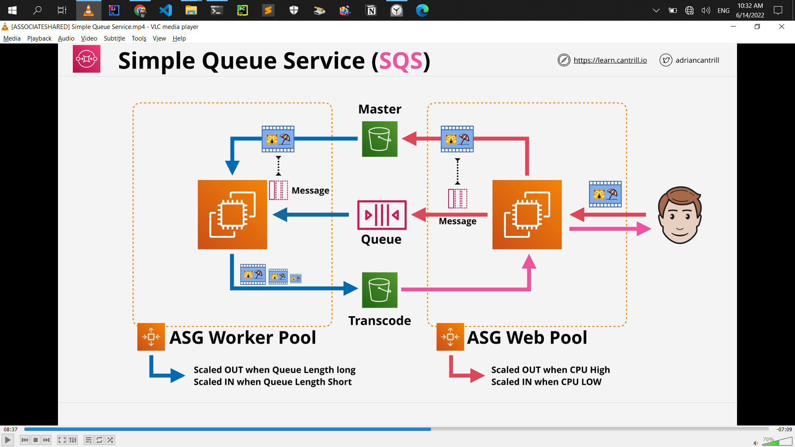
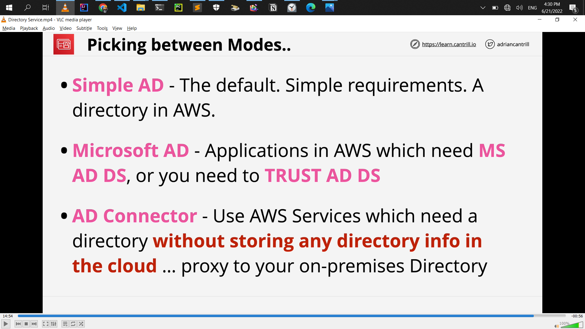

<!-- @format -->

# aws solution architect

## List of solutions

- sts = role

- s3 key = SSE-KMS
- **_Exam:_**

  - keys never leave KMS = KMS FIPS = 140-2 (L2) Level 2

- CMKs can be used for up to **4KB of data**

- KMS doesn't actually perform the encryption or decryption on the data larger than 4KB

- encryption key rotation = KMS
- **_Exam:_**

  - S3 encryption = SSE-C, SSE-S3 **(AES256)**, SSE-KMS
  - MFA is required to **delete versions**
  - MFA is required to change bucket **version state**

- **tow party or more involb = Asymmetric Encription**

  - 

- **one or single = symmetric Encription**

  - 

- **Asymmetric= signing**

  - 

- **hiding something in something else = Steganography**

  - 

- **S3 Lifecycle Configuration - Transitions**

  - **Minimum of 30 days** before transition
  - smaller objects can **cost more** (minimum size)
  - 

- S3 Tansfer Acceleration
  - default = off
  - the bucket name can not conatin periods
  - the bucket name needs to be DNS compatible
- Replication Time Control (RTC) = 15 minutes replication time

- # S3 Replication Considerations
  - **_Exam:_**
    - **Not retroactive**=_Replication_ & Versioning need to be **ON**
    - **One-way replication** Source to Destination
    - Unencrypted, SSE-S3 & SSE-KMS (**_with extra configuration_**)
    - Source bucket owner needs permission to object
    - No **system events**=_life cycle_, **Glaicer** or **Glacier Deep Archive**
    - **No DELETES**
- S3 is private by default
- VPC `Base IP +2` Address
- **enableDnsHostnames** - gives instances DNS Names
- **enableDnsSupport** - enables DNS resolution in VPC

- NAT gateway charges
  - running a NAT gateway hourly = $0.045 per hour
  - partial hour is full hour
  - The Data Processing charge will result in a charge of $0.045.
- NAT instance VS NAT gateway
  - NAT gateway = more cost, more capacity, more flexibility
  - NAT instance = less cost, less capacity, less flexibility
  - Disable **Source/Destination Checks** in NAT instance
- **NAT gateway = NACL = Network ACL** cannot be use security groups
- NAT Gateways **don't work with IPv6**
- Attached to ENI's not instances(even if the UI shows it this way)
- route table associated with many route table
- subnet only associated with one route table
- local route always take priority
- subnet to have a route table associated with the main VPC or custom you created the route table
- IGW **region resilient** gateway
- NAT **region resilient** gateway
- **instance it self is not configured with that public IP**
- **EC2 instance it just has a private IP**
- **one subnet is in one availability zone**

  - **subnet can never be in more than one availability zone**

## Subnet IP Addressing

- **Reserved IP addresses (5 in total)**

- **10.16.16.0/20 (10.16.16.0 => 10.16.31.255)**
- **Network Address (10.16.16.0)**

- **`Network +1` (10.16.16.1) - VPC Router**

- **`Network +2` (10.16.16.2) - Reserved (DNS\*)**
- **`Network +3` (10.16.16.3) - Reserved Future Use**

- **Broadcast Address 10.16.31.255 (Last IP in subnet)**

- ### Exam alert

  - **which IP Address range the EC2 instance connects service users**
    - [IP Address Range](https://ip-ranges.amazonaws.com/ip-ranges.json)

- ### Exam alert

  - This is need System Ops and Developer associate
  - **Storage performance in IOPS need to experienced**

- ### Exam alert
- ## Instance Store VS EBS

  - **Cheap = ST1 or SC1**

  - **Throughput .. streaming ... ST1**
  - **Boot ............. NOT ST1 or SC1**
  - **GP2/3 - up to 16,000 IOPS**

  - **101/2 - up to 64,000 1OPS (\*256,000)**
  - **RAIDO + EBS up to 260,000 IOPS (101/2-BE/GP2/3)**
  - **More than 260,000 IOPS - INSTANCE STORE**

  - 

- ### Exam alert
- ## EBS Snapshots/Volume Performance

  - **New EBS volume = full performance immediately**
  - **Snaps restore lazily - fetched gradually**
  - **Requested blocks are fetched immediately**

  - **Force a read of all data immediately ...**
  - **Fast Snapshot Restore (FSR) - Immediate restore**
  - **.. up to 50 snaps per region. Set on the Snap & AZ**

- ### AMI Exam Tips

  - **AMI = One Region, only works in that one region**
  - **AMI Baking .. creating an AMI from a configured instance +
    application**

  - **An AMI can't be edited .. launch instance, update
    configuration and make a new AMI**
  - **Can be copied between regions (includes its snapshots)**
  - **Remember permissions .. default = your account**

### EC2 Instance

- get instance metadata
- [http://169.254.169.254/latest/meta-data/](http://169.254.169.254/latest/meta-data/)

- ### It's critical to know in SystemOps

  - that at no point ever,
  - private IP address is exposed to the internet via NAT gateway

- ### Exam alert

  - **task definition** stores is the task role.
  - A task role is an IAM role that a task can assume. And when the task assumes that role, it gains temporary credentials, which can be used within the task to interact with AWS resources.
  - roles are always preferable than storing long-term credentials
    

- SSM Parameter Store

  - Storage for configuration & secrets
    String, StringList & SecureString
  - License codes, Database Strings, Full Configs & Passwords

  - Hierarchies & Versioning
  - Plaintext and Ciphertext
  - Public Parameters - Latest AMIs per region

- EC2 Placement Groups

  - understand between this 3 placement groups for exam
  - **Cluster** - Pack instances close together
  - **Spread** - Keep instances separated
  - **Partition** - groups of instances spread apart

- Dedicated Host Limitations & Features

  

- Enhanced Networking

  

- R53 CNAME VS ALIAS

  

  

- Route53 Simple Routing

  

- Route 53 Health Checks

- Route53 Failover Routing

- ACID vs BASE

- Exam Alert

  - BASE = NOSQL Database
  - ACID = RDS Database
  - NOSQL or DynamoDB with ACID = DynamoDB transection
  - only access RDS using CNAME and CNAME points normally at the primary instance
  - RDS MultiAZ can be used to scale the amount of reads != ?
  - don't fall for questions wich talk about MultiAZ across different regions != ?
    - it can only occur with other availiability zones inside the same VPC inside the same region
  - synchronous replication = MultiAZ
  - standby replica cannot be used to read, or write operations to the RDS instance
  - RDS Backups and Restores need to know for exam
  - you can plain disaster recovery within your business or understand and answer exam questions which involve disaster recovey and business continuty
  - RTO vs RPO need to know for exam
  - final snapshots backups Before RDS instance remove
  - synchronous replication = Multi-AZ
  - asynchronous replication = Read-Replica
  - Read-replicas are read-only until they're promoted read-replica to be read and write that process is not reversible and you have to delete and create new read replica
  - Fail-over times are typically 60 to 120 seconds
  - Aurora Global Database = global database allow you to create global level replication using Aurora from master region to up to five secondary AWS region

    

    

  - DMS = Data Migration Service
  - database migration scenario = default DMS, if say no downtime migration then you absolutely should default to DMS
  - SCT = only used for migrations when the engine is changing
  - EFS = Automatic backups need tp in details for exam

- SystemOps or Developer
  - Database authentication options
    - Database authentication inside = Password and IAM database authentication need to know
    - Architect need just = Password authentication
    - DataBase Monitoring CloudWatch = significantly need to knwo more
    - aurora
      - connectivity
      - Aadditional Configuration
      - Web Service Data API
        
- SystemOps or Developer or SA Pro or DevOps Pro

  - Database Additional configuration
    - need to know `DB parameter group` & `Option Group`

- **Authorisation** is controlled by the **_DB
  Engine_**, Permissions are assigned to
  the local DB User. **IAM is NOT used to
  authorise**, only for authentication
- Aurora Clsuter Volume: Max 128 TiB, 6 Replicas, AZs and per 2 replicas per AZs
- Aurora you've got 1 read/write primary instance and 15 different read replicas total 16 replica

# HA & SCALING

- Exam Alert
  - decide whether that Load Balancer shoud be internet-facing or wether it shoud be internal
    - if you pick internet-facing then the nodes of that Load Balancer are given public address and private addresss
    - if you pick internal then the nodes only have private IP addresses
  - internet-facing Load Balancer does not need private or public instances. **it can work with both of those**
    - **internet-facing LB nodes can be access **_public_** & **_private_** EC2 instance**
  - minimum per subnet `/27` for load balacner but if exam show `/28` dont show `/27` then `/28` is correct
  - **CROSS-ZONE LB** = not default enable
  - **ALB** = IS default enable as standard
  - **_EC2_** **doesn't need to be public** to work with a LB
  - **8+** Free IPs per subnet , and **/27** subnet to allow scaling
  - which are really stict on performance then you might want to look at Network Load Balancer **_(NLB)_**
  - if you have to forward encrypted connections throught to the instances without terminating them on the load balancer. then you need to use a Network Load Balancer
  - which talk about things which aren't web or secure web and don't use HTTP OR HTTPS = then you should probably default to Network Load balancers.
  - **Forward TCP** to instances ...**unbroken encryption**
  - Used with private link to provide services to other VPCs.
  - for any knwo periods of high or low usage = know periods of usage == then **Scheduled Scaling**

# SERVERLESS AND APPLICATION SERVICES

- Exam Alert

  - Lamda function = **900s** (**15**M maximum)
  - Docker **is not supported (anti pattern)** for the exam
  - Custom runtime such as **Rust** are possible using layers
  - lamda has two networking mode = public, VPC networking
  - lamda functions running in a **_VPC_** **obey all VPC networking rules**
  - executing Lamda functions within a VPC
    
  - synchronous invocation = by human
  - asynchronous invocation = by aws but indirectly human
  - Event Source mappings
  - lamda execution role needed
    
  - SNS Message are <=**256KB** payloads
    
  - State Machine

    - **Standard** Workflow and **Express** Workflow
    - **Standard** is the default and it has a one year exucation limit. = long running
    - **Express**, that's designed for high volume event processing workloads such as IOT, streaming data processing and tarnsformation, mobile application backend = run up to five minutes and highly transactional
      
      

    - Fanout = one SNS Topic Multiple subcriber and SQS as the same topic
      
      
      
      
    - standard queues like a multi-lane highway = **at-least-once** delivery and no guarantees on the order of that delivery
    - FIFO queues was like a single lane road = queues both gurantee the order and guarantee **exactly once delivery**
    - is that exam question about the ingestion of data or is it worker pools decoupling or does it mention a synchronous comunication,if it's about the ingestion of data or the ingestion of data at scale so large throughput or large numbers of devices = it's likely to be kinesis wich is the right answer
    - if it's about any of the others so worker pools decoupling or asynchronous communication = assume first that it's SQS
      
    - kinesis Data Firehouse wich combine the designed to scope with large amounts of streaming data ingestion, consumption and management within AWS
    - Wich need really complex manipulation data in real time = kinesis data analytics
    - kinesis Data Firehouse it is not a real time product. **it is a near real-time product.** near real-time delivery (**~60 seconds**)
    - So even though Firehouse gets the data in real time, it doesn't deliver it to the destination in real time.
    - AWS perspective, something in the range of 200 milliseconds would be a real time product, but something in the range of 60 seconds would be classified as a near real time
      
    - CloudFront , if you're wanting to add any certificate they always need to be in **us-east-1**
      
      
      
    - Two SSL Connection = Both Need valid public certificate
    - custom origin = Minimum Origin SSL Prtocol, Origin Protocol Policy, HTTP Port, HTTPS Port
    - two type of origin = S3 Origin, Custom Origin
    - CloudFront private distribution = Trusted key groups (recommended), Trusted signer
    - CloudFront Enable real-time logs using kinesis
    - Cloud front = restrict viewers Access ( use signed url or Cookie) yes , no
    - Trusted signer = restrict viewers Access, self, specify account
    - Cloud front behavior cashing
    - Cloud front = version filename is cost effective
    - Cloud front need trusted certificate and not self signed
    - Global performance optimization = TCP/UDP = AWS Global accelerator
    - caching = CloudFront
    - AWS lambda@edge
    - AWS Global accelerator

- ## SystemOps or Developer

  - API Gateway

- ## Developer
  - CloudFront
    - ## Cache key and origin requests
      - Origin requests policy -optional
        
- the way that the kinesis stream scales is by using a shared architecture

# ADVANCED VPC Networking

- Exam Alert

  - Gateway endpoint use prifix list and route table
  - Interface endpoint uses DNS and enterface private endpoint
  - Interface endpoint don't' use routing they use **DNS**
  - Gateway endpoint is (**HA**) Highly Available service
  - Gateway endpoint use private VPC only
  - Gateway endpoint ONLY accessable from inside the specific VPC. there logical gateway object and you can only access logical gateway created inside VPC from that VPC

# HYBRID ENVIRONMENTS AND MIGRATION

- partial high availability
  
- BGP = dynamic VPN
- static routes take priority over propagated routes
- Site to site VPN backup for **DX**
- transit gateway = highly available inter VPC router
- so when you think stoage gateway, think extention, migration and backup
- Storage gateway = migration and disaster recovery
- Exam Alert
  - if you need more than 1.25 Gb per second, then you can't use VPNs.
  - virtual private gateway as a whole. So for all VPN connections connecting to that Virtual Private Gateway. and that's also 1.25 gigabits per second.
  - VPN are quickly configurable within hours
  - TGW
  - TGW can be use to create global network
  - TGW = deferent region or same and cross account
  - active directory required
  - AWS data sync 2 question must
  - Intrigate with S3,EFS,EFS bi derectional and incremental transfer and schedule transfer= AWS data sync
  - Schedule , throtlink, automatic rewrites, compression , huge scale transfer , traditional file transfer protocol = data sync
  - Intrigates with directory service or self managed AD = Fsx
    
  - windows, SMB mentioned = FSx for Windows
  - Lustre, really high-end performance requirements, POSIX, high performance computing machine learning , big data = FSx for Lustre
  - machine learning and SageMaker and you need to have access to a really high performance file system = FSx for Lustre

# SECURITY, DEPLOYMENT & OPERATIONS

- AWS Config = System manager, Lamda for account level think
- SSM Parameter Store = instances
- ## Exam Alert
  - 
  - rotation, integration, sceret, RDS , API KEY, password = AWS Secrets Manager
  - Shield and WAF in SAAC02 exam
  - Shield provide DDos protection
    
  - global perimeter protection AWS Shield and WAF
    
  - hardware security module using industry-standard APIs = CloudHSM
  - classification of data within S3, so identifying data, discovering data, or reacting to sensitive data automatically, Then **_Macie_** is probably the product to use.
  - security report = think inspecter
  - network Reachability = inspecter
  - (**CVE**) = inspecter
  - Disabling root logins over SSH. only using modern version numbers SSH Password, complexity checks and permissions on certain folders. = inspecter
    

# Infrastructure as Code (CloudFormation)

- stack instance as a container for individual stack
- Exam Alert
  - template is not a stack
  - reuses template then you choose to use Nested Stacks
  - reuses the stack = Cross-Stack References
  - where identity needs to use cloudformation to do things that they wouldn't otherwise be allowed to do outside of cloudformation. then **stack roles** is great solutionto allow this.

# NOSQL Databases & DynamoDB

- Exam Alert

  - 60 items will be written per minute, and if you see that type of questions, you need to try and calculate how many per second
    
    
  - local secondary indexes allow you to create an alternative view on the data that's in a base table by providing an alternative sort key.
  - use streams and Lamda together to implement a trigger architecture for DynamoDB
    
  - if your application cannot tolerate eventual consistency, DAX is not going to be suitable.
  - caching requirement with DynamoDB, then you should by default assume it is DAX
  - which talk about the data being stored inside S3, and if the data is structured, or semi-structured or unstructured and you need to perform ad hoc queries.

# Practice Exam

- Tier-1 (32TB)
- GuardDuty? = VPC Flow Logs, DNS logs, CloudTrail events
- Amazon GuardDuty offers threat detection that enables you to continuously monitor and protect your AWS accounts, workloads, and data stored in Amazon S3.
- When you batch **10 messages** per operation (maximum), FIFO queues can support **up to 3,000 messages** per second **3\*4=12**
  Therefore you need to process 4 messages per operation so that the FIFO queue can support up to 1200 messages per second, which is well within the peak rate.
- SSE-KMS
- Multi-AZ follows synchronous replication and spans at least two Availability Zones within a single region. Read replicas follow asynchronous replication and can be within an Availability Zone, Cross-AZ, or Cross-Region
- (S3TA) you pay only for transfers that are accelerated
- **When you apply a retention period to an object version explicitly, you specify a** `Retain Until Date` **for the object version** - You can place a retention period on an object version either explicitly or through a bucket default setting. **When you apply a retention period to an object version explicitly, you specify a** `Retain Until Date` for the object version. Amazon S3 stores the `Retain Until Date` setting in the object version's metadata and protects the object version until the retention period expires.

- **Different versions of a single object can have different retention modes and periods** - Like all other Object Lock settings, retention periods apply to individual object versions. **Different versions of a single object can have different retention modes and periods**.

  For example, suppose that you have an object that is **_15 days_** into a **_30-day_** retention period, and you PUT an object into Amazon S3 with the same name and a **_60-day_** retention period. In this case, your PUT succeeds, and Amazon S3 creates a new version of the object with a **_60-day_** retention period. The older version maintains its original retention period and becomes deletable in 15 days.

- ### ECS with EC2 launch type is charged based on **_EC2 instances and EBS volumes_** used. ECS with Fargate launch type is charged based on **_vCPU_** and **_memory resources_** that the containerized application requests

- ### Use io2 Block Express volumes on Nitro-based EC2 instances to achieve a maximum Provisioned IOPS of 256,000

- ### Use io1/io2 volumes to enable Multi-Attach on Nitro-based EC2 instances

- Store the intermediary query results in S3 Standard storage class

- Put the instance into the Standby state and then update the instance by applying the maintenance patch. Once the instance is ready, you can exit the Standby state and then return the instance to service

- Suspend the ReplaceUnhealthy process type for the Auto Scaling group and apply the maintenance patch to the instance. Once the instance is ready, you can manually set the instance's health status back to healthy and activate the ReplaceUnhealthy process type again

- hub-and-spoke network with AWS Transit Gateway = **Build a shared services VPC**

- RDS read replicas = There are data transfer charges for replicating data across AWS Regions

- A read replica is billed as a standard DB Instance and at the same rates. You are not charged for the data transfer incurred in replicating data between your source DB instance and read replica within the same AWS Region.

- Deploy the instances in three Availability Zones. Launch two instances in each Availability Zone

- in order = FIFO queues / FIFO SNS TOPIC
- Set up a Route 53 failover record. Run application servers on EC2 instances behind an Application Load Balancer in an Auto Scaling group. Set up AWS Storage Gateway with stored volumes to back up data to S3

- AWS supports six types of policies: identity-based policies, resource-based policies, permissions boundaries, Organizations SCPs, ACLs, and session policies.

- Take a snapshot of the database, copy it as an encrypted snapshot, and restore a database from the encrypted snapshot. Terminate the previous database

- Enable storage auto-scaling for RDS MySQL

- downstream analytics, no ongoing administration = **Kinesis Data Firehose**

- ## Exam Alert:

- ### Please review the following note to understand the differences between Cognito User Pools and Cognito Identity Pools:

  

  

  

- Create a Snowball job and target an S3 bucket. Create a lifecycle policy to immediately move data to Glacier Deep Archive

- ### You may see the Snowball device on the exam, just remember that the original Snowball device had 80TB of storage space.

- Cost of test file storage on S3 Standard < Cost of test file storage on EFS <a Cost of test file storage on EBS

- Create a VPC in an account and share one or more of its subnets with the other accounts using Resource Access Manager

- single-tenant = Dedicated Instances

- Kinesis Agent cannot write to a Kinesis Firehose for which the delivery stream source is already set as Kinesis Data

  90USD = 338SA = 8296BD

  90.00USD = 8277.82

  ISLAMI BANK 92.5\*90=8325 AFTER TRANSECTION 3.6% VAT INCLUDE 8624.7

  1USD=91.98BD

- The health check grace period for the instance has not expired

- The instance maybe in Impaired status

- The instance has failed the ELB health check status

- Create an encrypted snapshot of the database, share the snapshot, and allow access to the AWS Key Management Service (AWS KMS) encryption key

- Use Amazon Aurora Global Database to enable fast local reads with low latency in each region

- Max I/O performance mode = Highly parallelized applications and workloads, such as big data analysis, media processing, and genomic analysis, can benefit from this mode.

- If the master database is encrypted, the read replicas are encrypted

- DFSR = FSx for Windows

  

  

  

- Create an ASG with a launch template

- Setup a lifecycle policy to transition the raw zone data into Glacier Deep Archive after 1 day of object creation

- Use Glue ETL job to write the transformed data in the refined zone using a compressed file format

- Hadoop cluster = Partition placement group

  

  

- Set up an Aurora multi-master DB cluster

- By default, an S3 object is owned by the AWS account that uploaded it. So the S3 bucket owner will not implicitly have access to the objects written by Redshift cluster

- Use AWS Global Accelerator to distribute a portion of traffic to a particular deploymen

- ### Per the default termination policy, the first priority is given to any allocation strategy for On-Demand vs Spot instances. As no such information has been provided for the given use-case, so this criterion can be ignored. The next priority is to consider any instance with the oldest launch template unless there is an instance that uses a launch configuration. So this rules out Instance A. Next, you need to consider any instance which has the oldest launch configuration. This implies Instance B will be selected for termination and Instance C will also be ruled out as it has the newest launch configuration. Instance D, which is closest to the next billing hour, is not selected as this criterion is last in the order of priority.

- ### You would like to migrate an AWS account from an AWS Organization A to an AWS Organization B. What are the steps do to it?

  - ### Remove the member account from the old organization. Send an invite to the member account from the new Organization. Accept the invite to the new organization from the member account

- ### Create an IP match condition in the WAF to block the malicious IP address

- ### Delete the existing standard queue and recreate it as a FIFO queue

- ### Make sure that the name of the FIFO queue ends with the .fifo suffix

- ### Make sure that the throughput for the target FIFO queue does not excee- d 3,000 messages per second

- Use VPC sharing to share one or more subnets with other AWS accounts belonging to the same parent organization from AWS Organizations

- Enable EC2 detailed monitoring

- ### AWS Kinesis Data Streams

  - Amazon Kinesis Data Streams (KDS) is a massively scalable and durable real-time data streaming service. KDS can continuously capture gigabytes of data per second from hundreds of thousands of sources such as website **clickstreams, database event streams, financial transactions, social media feeds, IT logs, and location-tracking events.** The data collected is available in milliseconds to enable real-time analytics use cases such as real-time dashboards, real-time anomaly detection, dynamic pricing, and more

- High Performance Computing (HPC) = Elastic Fabric Adapter

- You can copy an AMI across AWS Regions

- You can share an AMI with another AWS account

- Copying an AMI backed by an encrypted snapshot cannot result in an unencrypted target snapshot

- ### Amazon EC2 Auto Scaling chooses the policy that provides the largest capacity, so policy with the custom metric is triggered, and two new instances will be launched by the ASG

  

  

  

- Use VPC endpoint to access Amazon SQS

- ### Please note the following effects on permissions vis-a-vis the SCPs:

  - If a user or role has an IAM permission policy that grants access to an action that is either not allowed or explicitly denied by the applicable SCPs, the user or role can't perform that action.

  - SCPs affect all users and roles in the attached accounts, including the root user.

  - SCPs do not affect any service-linked role.

- orchestration solution = AWS Step Functions

- NAT instance can be used as a bastion server

- Security Groups can be associated with a NAT instance

- NAT instance supports port forwarding

  

  

  

- Create a Virtual Private Gateway on the AWS side of the VPN and a Customer Gateway on the on-premises side of the VPN

- Create an alias record for covid19survey.com that routes traffic to www.covid19survey.com

- ## Exam Alert:

  - ### You should also note that Route 53 doesn't charge for alias queries to AWS resources but Route 53 does charge for CNAME queries. Additionally, an alias record can only redirect queries to selected AWS resources such as S3 buckets, CloudFront distributions, and another record in the same Route 53 hosted zone; however a CNAME record can redirect DNS queries to any DNS record. So, you can create a CNAME record that redirects queries from app.covid19survey.com to app.covid19survey.net.

- Create an **inbound endpoint** on Route 53 Resolver and then **DNS resolvers on the on-premises** network can **forward DNS queries to Route 53 Resolver via this endpoint**

- Create an **outbound endpoint** on Route 53 Resolver and then **Route 53 Resolver can conditionally forward queries** to resolvers on the **on-premises network via this endpoint**

- VPN CloudHub

  - If you have multiple AWS Site-to-Site VPN connections, you can provide secure communication between sites using the AWS VPN CloudHub. This enables your remote sites to communicate with each other, and not just with the VPC. Sites that use AWS Direct Connect connections to the virtual private gateway can also be part of the AWS VPN CloudHub. The VPN CloudHub operates on a simple hub-and-spoke model that you can use with or without a VPC. This design is suitable if you have multiple branch offices and existing internet connections and would like to implement a convenient, potentially low-cost hub-and-spoke model for primary or backup connectivity between these remote offices.

- You can change the tenancy of an instance from dedicated to host

- You can change the tenancy of an instance from host to dedicated

- ## AWS Managed Microsoft AD

  - AWS Directory Service provides multiple ways to use Amazon Cloud Directory and Microsoft Active Directory (AD) with other AWS services.

    - AWS Directory Service for Microsoft Active Directory (aka AWS Managed Microsoft AD) is powered by an actual Microsoft Windows Server Active Directory (AD), managed by AWS. With AWS Managed Microsoft AD, you can run directory-aware workloads in the AWS Cloud such as SQL Server-based applications. You can also configure a trust relationship between AWS Managed Microsoft AD in the AWS Cloud and your existing on-premises Microsoft Active Directory, providing users and groups with access to resources in either domain, using single sign-on (SSO).

  

  

  

  

  

- Use message timers to postpone the delivery of certain messages to the queue by one minute

- Use Global Accelerator to provide a low latency way to distribute live sports results = for non-HTTP use cases, such as gaming (UDP), IoT (MQTT), or Voice over IP. Therefore,

- Provision Amazon Aurora Global Database = RPO, RTO

- Configure a NAT Gateway in the public subnet of the VPC

- With **cross-zone** load balancing **enabled**, one instance in Availability Zone A **receives 20% traffic** and four instances in Availability Zone B **receive 20% traffic** each. With cross-zone load balancing **disabled**, one instance in Availability Zone A **receives 50% traffic** and four instances in Availability Zone B **receive 12.5%** traffic each

- Use SQS long polling to retrieve messages from your Amazon SQS queues

  - Amazon Simple Queue Service (SQS) is a fully managed message queuing service that enables you to decouple and scale microservices, distributed systems, and serverless applications.

  - Amazon SQS provides short polling and long polling to receive messages from a queue. By default, queues use short polling. With short polling, Amazon SQS sends the response right away, even if the query found no messages. With long polling, Amazon SQS sends a response after it collects at least one available message, up to the maximum number of messages specified in the request. Amazon SQS sends an empty response only if the polling wait time expires.

  - Long polling makes it inexpensive to retrieve messages from your Amazon SQS queue as soon as the messages are available. Using long polling can reduce the cost of using SQS because you can reduce the number of empty receives.

- A Gateway Endpoint is a gateway that you specify as a target for a route in your route table for traffic destined to a supported AWS service. The following AWS services are supported: Amazon S3 and DynamoDB.

- You must remember that only these two services use a VPC gateway endpoint. The rest of the AWS services use VPC interface endpoints.

- Pilot Light - The term pilot light is often used to describe a DR scenario in which a minimal version of an environment is always running in the cloud. The idea of the pilot light is an analogy that comes from the gas heater. In a gas heater, a small flame that’s always on can quickly ignite the entire furnace to heat up a house. This scenario is similar to a backup-and-restore scenario. For example, with AWS you can maintain a pilot light by configuring and running the most critical core elements of your system in AWS. For the given use-case, a small part of the backup infrastructure is always running simultaneously syncing mutable data (such as databases or documents) so that there is no loss of critical data. When the time comes for recovery, you can rapidly provision a full-scale production environment around the critical core. For Pilot light, RPO is in minutes, so this is the correct solution.

- By default,
- Lambda functions always operate from an AWS-owned VPC and hence have access to any public internet address or public AWS APIs. Once a Lambda function is VPC-enabled,
- it will need a route through a NAT gateway in a public subnet to access public resources

- Use S3 Object Lock

  - Amazon S3 Object Lock is an Amazon S3 feature that allows you to store objects using a write once, **read many (WORM) model**. You can use WORM protection for scenarios where it is imperative that data is not changed or deleted after it has been written. Whether your business has a requirement to satisfy compliance regulations in the financial or healthcare sector, or you simply want to capture a golden copy of business records for later auditing and reconciliation, S3 Object Lock is the right tool for you. Object Lock can help prevent objects from being deleted or overwritten for a fixed amount of time or indefinitely.

- The TTL is still in effect - TTL (time to live), is the amount of time, in seconds, that you want DNS recursive resolvers to cache information about a record. If you specify a longer value (for example, 172800 seconds, or two days), you reduce the number of calls that DNS recursive resolvers must make to Route 53 to get the latest information for the record. This has the effect of reducing latency and reducing your bill for Route 53 service.

  - However, if you specify a longer value for TTL, it takes longer for changes to the record (for example, a new IP address) to take effect because recursive resolvers use the values in their cache for longer periods before they ask Route 53 for the latest information. If you're changing settings for a domain or subdomain that's already in use, AWS recommends that you initially specify a shorter value, such as 300 seconds, and increase the value after you confirm that the new settings are correct.

  - For this use-case, the most likely issue is that the TTL is still in effect so you have to wait until it expires for the new request to perform another DNS query and get the value for the new Load Balancer.

- ### Copy data from the source bucket to the destination bucket using the aws S3 sync command

  - The aws S3 sync command uses the CopyObject APIs to copy objects between S3 buckets. The sync command lists the source and target buckets to identify objects that are in the source bucket but that aren't in the target bucket. The command also identifies objects in the source bucket that have different LastModified dates than the objects that are in the target bucket. The sync command on a versioned bucket copies only the current version of the object—previous versions aren't copied. By default, this preserves object metadata, but the access control lists (ACLs) are set to FULL_CONTROL for your AWS account, which removes any additional ACLs. If the operation fails, you can run the sync command again without duplicating previously copied objects.
  - You can use the command like so:

    `aws s3 sync s3://DOC-EXAMPLE-BUCKET-SOURCE s3://DOC-EXAMPLE-BUCKET-TARGET`

- Amazon MQ

  - Amazon MQ is a managed message broker service for Apache ActiveMQ that makes it easy to set up and operate message brokers in the cloud. Message brokers allow different software systems–often using different programming languages, and on different platforms–to communicate and exchange information. If an organization is using messaging with existing applications and wants to move the messaging service to the cloud quickly and easily, AWS recommends Amazon MQ for such a use case. Connecting your current applications to Amazon MQ is easy because it uses industry-standard APIs and protocols for messaging, including JMS, NMS, AMQP, STOMP, MQTT, and WebSocket.

    Therefore, the only possible answer is Amazon MQ.

- EBS
  

- CloudFront can route to multiple origins based on the content type

- Use an origin group with primary and secondary origins to configure CloudFront for high availability and failover

- Use field level encryption in CloudFront to protect sensitive data for specific content

- ### The instance with the oldest launch configuration will be terminated in AZ-B

  - Amazon EC2 Auto Scaling helps you ensure that you have the correct number of Amazon EC2 instances available to handle the load for your application. You create collections of EC2 instances, called Auto Scaling groups. You can specify the minimum number of instances in each Auto Scaling group, and Amazon EC2 Auto Scaling ensures that your group never goes below this size.

    With each Auto Scaling group, you can control when it adds instances (referred to as scaling out) or removes instances (referred to as scaling in) from your network architecture.

    The default termination policy is designed to help ensure that your instances span Availability Zones evenly for high availability. The default policy is kept generic and flexible to cover a range of scenarios.

    The default termination policy behavior is as follows: 1. Determine which Availability Zones have the most instances and at least one instance that is not protected from scale-in. 2. Determine which instances to terminate to align the remaining instances to the allocation strategy for the On-Demand or Spot Instance that is terminating. 3. Determine whether any of the instances use the oldest launch template or configuration: 3.a. Determine whether any of the instances use the oldest launch template unless there are instances that use a launch configuration. 3.b. Determine whether any of the instances use the oldest launch configuration. 4. After applying all of the above criteria, if there are multiple unprotected instances to terminate, determine which instances are closest to the next billing hour.

    Per the given use-case, **AZs will be balanced first**, then the instance with the **oldest launch configuration within that AZ** will be terminated.

- Use DynamoDB DAX

- **Use a Network Load Balancer with an Auto Scaling Group (ASG)**

- Warm Standby

  - The term warm standby is used to describe a DR scenario in which a scaled-down version of a fully functional environment is always running in the cloud. A warm standby solution extends the pilot light elements and preparation. It further decreases the recovery time because some services are always running. By identifying your business-critical systems, you can fully duplicate these systems on AWS and have them always on.

- X-Ray

- Use multi-part upload feature of Amazon S3

- ### Leverage AWS Database Migration Service (AWS DMS) as a bridge between Amazon S3 and Amazon Kinesis Data Streams

- Create a CloudFront distribution

- As a solutions architect, you would like to adhere to the security pillar of the well-architected framework. How do you configure the security group of the EC2 instances to only allow traffic coming from the ALB?

  - Add a rule to authorize the security group of the ALB

- Amazon Workspaces
  - Amazon WorkSpaces is a managed, secure Desktop-as-a-Service (DaaS) solution. You can use Amazon WorkSpaces to provision either Windows or Linux desktops in just a few minutes and quickly scale to provide thousands of desktops to workers across the globe. You can pay either monthly or hourly, just for the WorkSpaces you launch, which helps you save money when compared to traditional desktops and on-premises VDI solutions. Amazon WorkSpaces helps you eliminate the complexity in managing hardware inventory, OS versions and patches, and Virtual Desktop Infrastructure (VDI), which helps simplify your desktop delivery strategy. With Amazon WorkSpaces, your users get a fast, responsive desktop of their choice that they can access anywhere, anytime, from any supported device.
- Opt for Multi-AZ configuration with automatic failover functionality to help mitigate failure

- each other = VPC peering

- Each of the four targets in AZ-A receives 12.5% of the traffic

  - The nodes for your load balancer distribute requests from clients to registered targets. When cross-zone load balancing is enabled, each load balancer node distributes traffic across the registered targets in all enabled Availability Zones. When cross-zone load balancing is disabled, each load balancer node distributes traffic only across the registered targets in its Availability Zone.

    Route 53 will distribute traffic such that each load balancer node receives 50% of the traffic from the clients.

    If cross-zone load balancing is disabled: 1. Each of the four targets in AZ-A receives 12.5% of the traffic. 2. Each of the six targets in AZ-B receives 8.3% of the traffic.

    This is because each load balancer node can route its 50% of the client traffic only to targets in its Availability Zone.

- asynchronously decouple the architecture? = Use Amazon EventBridge to decouple the system architecture
