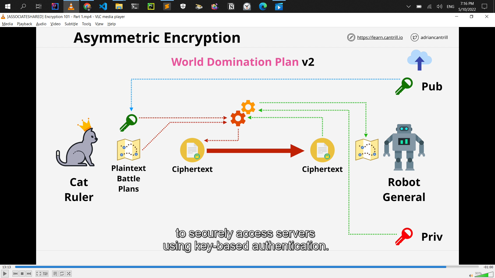

<!-- @format -->

# aws solution architect

## List of solutions

- sts = role

- s3 key = SSE-KMS
- **_Exam:_**

  - keys never leave KMS = KMS FIPS = 140-2 (L2) Level 2

- CMKs can be used for up to **4KB of data**

- KMS doesn't actually perform the encryption or decryption on the data larger than 4KB

- encryption key rotation = KMS
- **_Exam:_**

  - S3 encryption = SSE-C, SSE-S3 **(AES256)**, SSE-KMS
  - MFA is required to **delete versions**
  - MFA is required to change bucket **version state**

- **tow party or more involb = Asymmetric Encription**

  - 

- **one or single = symmetric Encription**

  - 

- **Asymmetric= signing**

  - 

- **hiding something in something else = Steganography**

  - 

- **S3 Lifecycle Configuration - Transitions**

  - **Minimum of 30 days** before transition
  - smaller objects can **cost more** (minimum size)
  - 

- S3 Tansfer Acceleration
  - default = off
  - the bucket name can not conatin periods
  - the bucket name needs to be DNS compatible
- Replication Time Control (RTC) = 15 minutes replication time

- # S3 Replication Considerations
  - **_Exam:_**
    - **Not retroactive**=_Replication_ & Versioning need to be **ON**
    - **One-way replication** Source to Destination
    - Unencrypted, SSE-S3 & SSE-KMS (**_with extra configuration_**)
    - Source bucket owner needs permission to object
    - No **system events**=_life cycle_, **Glaicer** or **Glacier Deep Archive**
    - **No DELETES**
- S3 is private by default
- VPC `Base IP +2` Address
- **enableDnsHostnames** - gives instances DNS Names
- **enableDnsSupport** - enables DNS resolution in VPC

- NAT gateway charges
  - running a NAT gateway hourly = $0.045 per hour
  - partial hour is full hour
  - The Data Processing charge will result in a charge of $0.045.
- NAT instance VS NAT gateway
  - NAT gateway = more cost, more capacity, more flexibility
  - NAT instance = less cost, less capacity, less flexibility
  - Disable **Source/Destination Checks** in NAT instance
- **NAT gateway = NACL = Network ACL** cannot be use security groups
- NAT Gateways **don't work with IPv6**
- Attached to ENI's not instances(even if the UI shows it this way)
- route table associated with many route table
- subnet only associated with one route table
- local route always take priority
- subnet to have a route table associated with the main VPC or custom you created the route table
- IGW **region resilient** gateway
- NAT **region resilient** gateway
- **instance it self is not configured with that public IP**
- **EC2 instance it just has a private IP**
- **one subnet is in one availability zone**

  - **subnet can never be in more than one availability zone**

## Subnet IP Addressing

- **Reserved IP addresses (5 in total)**

- **10.16.16.0/20 (10.16.16.0 => 10.16.31.255)**
- **Network Address (10.16.16.0)**

- **'Network +1' (10.16.16.1) - VPC Router**

- **'Network +2' (10.16.16.2) - Reserved (DNS\*)**
- **'Network +3' (10.16.16.3) - Reserved Future Use**

- **Broadcast Address 10.16.31.255 (Last IP in subnet)**
